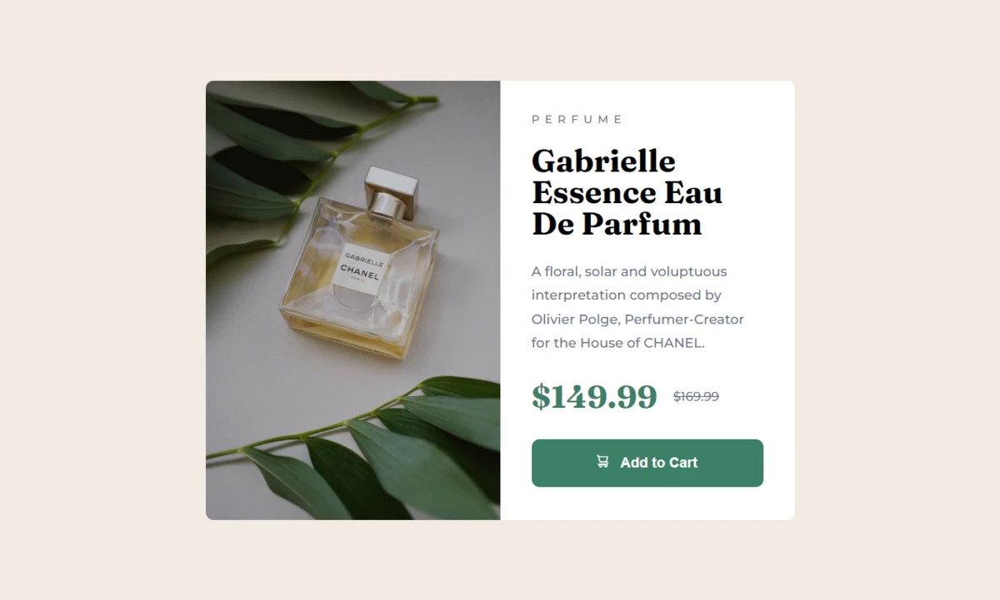

  
  <h2></h2>
  

    <a href="https://www.frontendmentor.io/challenges/news-homepage-H6SWTa1MFl"><strong>Frontend Mentor Challenge</strong></a>
     
     
    <a href="https://bennatbjoern.github.io/product-preview-card-component/">View Demo</a>
    &nbsp;·&nbsp;
    <a href="https://github.com/BennatBjoern/product-preview-card-component/issues">Report Bug</a>
    &nbsp;·&nbsp;
    <a href="https://github.com/BennatBjoern/product-preview-card-component/issues">Request Feature</a>
  

<!-- Badges -->

  <!-- Profiles -->
   &nbsp;&nbsp;&nbsp;

  <!-- Status -->
   &nbsp;&nbsp;&nbsp;

  <!-- Difficulty -->
  

 
 

## **Preview**

 

## **Links**

|                |                                                                                                          |
| :------------- | :------------------------------------------------------------------------------------------------------- |
| Solution URL:  | [Frontendmentor](https://www.frontendmentor.io/challenges/product-preview-card-component-GO7UmttRfa/hub) |
| Live Site URL: | [Github Pages](https://bennatbjoern.github.io/product-preview-card-component/)                           |
|                |                                                                                                          |

 

## The Challenge

- The challenge is to build out this Product Preview Card Component and get it looking as close to the design as possible.
- Users should be able to:
  - View the optimal layout for the site depending on their device's screen size
  - See hover states for all interactive elements on the page

 

## **Built With**

 &nbsp;  &nbsp; 

 

- Frontend Mentor - [@bennatbjoern](https://www.frontendmentor.io/profile/BennatBjoern)
- Twitter - [@bjoernbennat](https://twitter.com/bjoerncodes)
